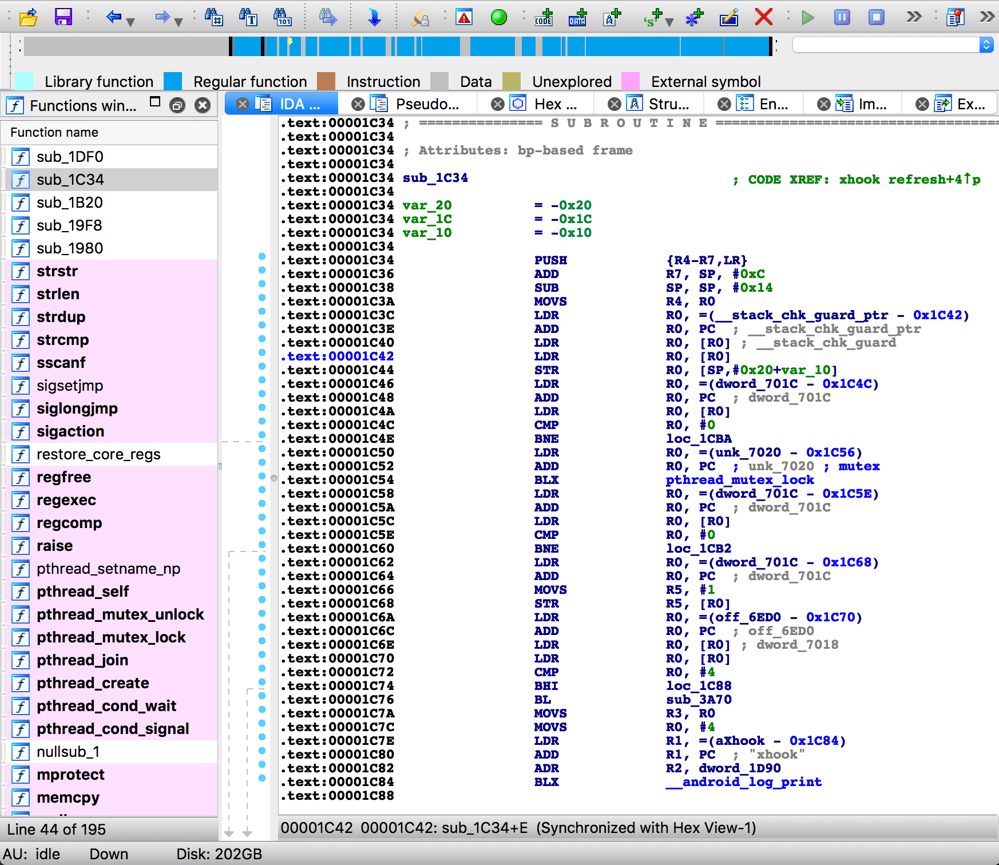
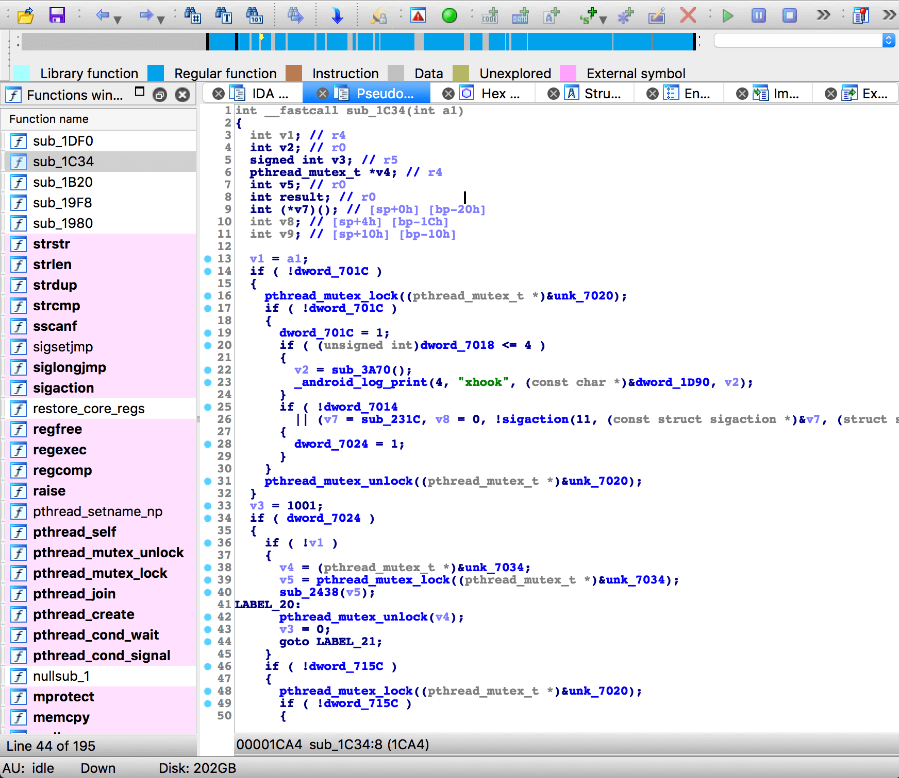
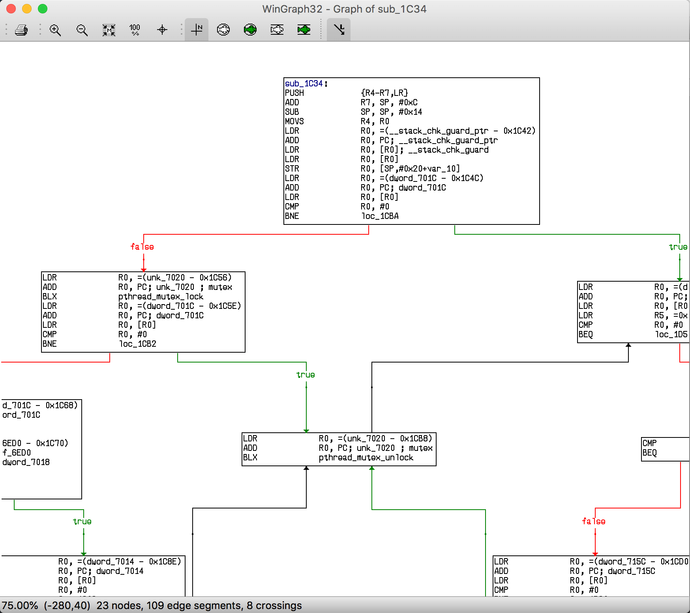
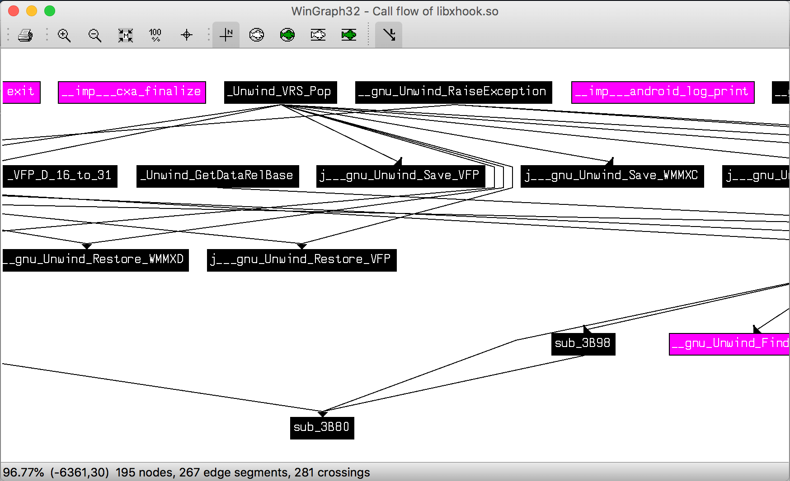
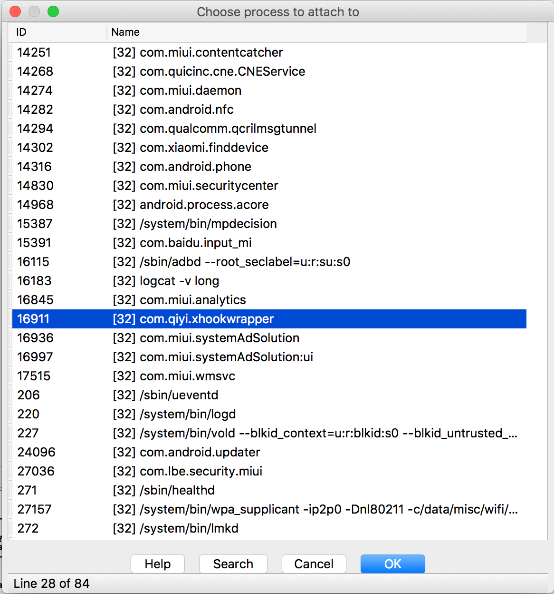
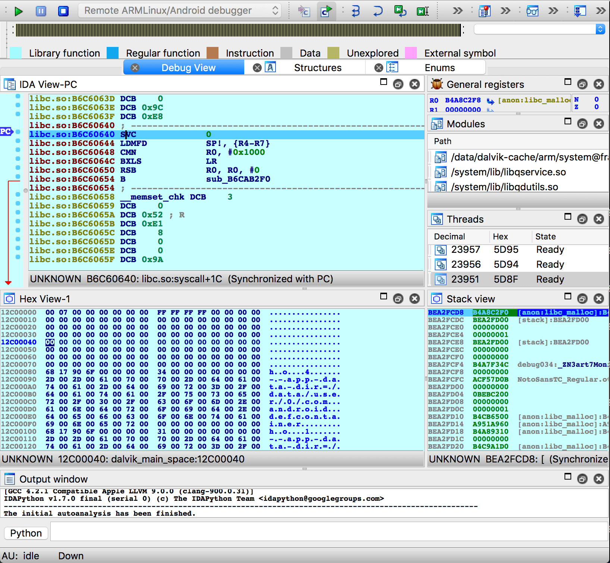
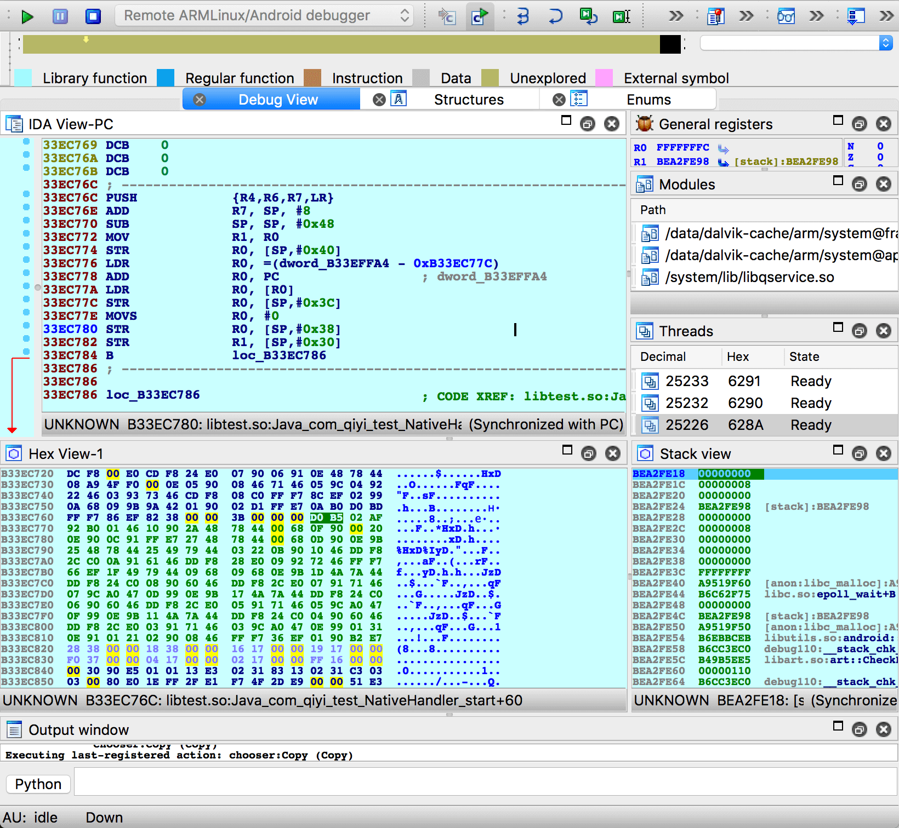

# **IDA Pro 静态分析与动态分析**

date: 2018-06-26


# 概述


## 为何反汇编

常见的原因有：

* 分析恶意软件。
* 分析闭源软件的漏洞。
* 分析闭源软件的实现方式和交互操作。
* 分析编译器生成的代码，以验证编译器的优化选项和正确性。
* 配合调试器显示程序指令。


## 如何反汇编

大致的流程：

* 确定需要进行反汇编的代码区域。（并不像看起来这么简单，指令和数据通常混杂在一起）
* 逐条读取指令，查表，输出汇编语言描述符。（需处理：指令长度可变、指令前缀影响指令行为、指令操作数确定等问题）
* 确定各个函数的起始和结束位置。

反汇编常用的方法有两种：

* 线性扫描法。
* 递归下降法。

相对来说，线性扫描法实现起来比较容易，objdump 就是使用此种方法。线性扫描法的主要缺点，是无法有效的将指令和数据分离，有时会错误的把数据部分反编译成指令。递归下降法强调控制流的概念，控制流根据一条指令是否被另一条指令引用来决定是否对其进行反汇编，很大程度上克服了线性扫描法带来的缺点，IDA Pro 使用递归下降法进行反汇编。

因此，同一个二进制文件用 objdump 和 IDA Pro 反汇编后的输出有少许区别并不奇怪。


## IDA Pro 介绍

IDA 是 [Hex-Rays](https://www.hex-rays.com/) 公司出品的一款交互式的反汇编器和调试器，由传奇程序员 [Ilfak Guilfanov](http://www.hexblog.com/) 开发。IDA 分为 Pro 和 Starter 两个版本，Pro 版本的功能更完整和强大。

IDA 本身是闭源的收费程序，且价格比较昂贵。IDA 使用了分 CPU arch 的授权模式，比如你仅需要反汇编 x86 代码，只需购买 Base License + x86 Decompiler License，如果你碰巧还需要反汇编 arm64 代码，那就需要购买 Base License + x86 Decompiler License + ARM64 Decompiler License。具体价格可以到 [Hex-Rays 的官网](https://www.hex-rays.com/cgi-bin/quote.cgi) 查看。

相对于 [objdump](https://www.gnu.org/software/binutils/) 等免费的反汇编工具，IDA Pro 具有更加强大的功能。IDA Pro 可以分析各种平台的各种格式的可执行二进制文件，比如：ELF、windows PE、Android dex、Java .class、Python .pyc 等等。IDA 的核心处理器模块甚至可以通过 SDK 扩展，用于支持自定义格式的二进制文件分析。

IDA Pro 的基本功能：

* 对可执行文件进行静态分析。
* 修改可执行文件，生成 patch。
* 调试可执行文件。（动态分析）

IDA Pro 提供强大的扩展和插件功能，扩展和插件可以干预 IDA Pro 执行静态分析和动态分析的过程。扩展和插件机制不仅给 IDA 带来了更加丰富多样的功能，有时候，编写自定义扩展脚本也是一种对抗“反静态分析”和“反动态分析”的有效手段。目前 IDA Pro 支持使用以下三种方式编写扩展和插件：

* IDA SDK（以 C++ 库和头文件的形式提供）
* 专用的 IDC 脚本语言（底层调用 IDA SDK）
* IDAPython（本身是一个 IDA 的插件，提供 Python 接口，底层调用 IDA SDK）

IDA 的插件有开源的，有免费的，也有付费的，个别强大的插件的价格甚至比 IDA 主程序的价格更贵。


# IDA Pro 静态分析

静态分析比较简单，以 Android native so 为例，用 IDA Pro 打开 so 文件后的界面：



主界面左边是函数列表，右边的窗口区域目前展示的是反汇编输出。IDA Pro 的反汇编输出包含了大量注释和命名变量，已经是十分友好的汇编输出了。通过双击函数名、右键或主菜单选 Jump to xref，可以跳转到函数的定义处，或函数的调用处。

使用 IDA Pro 的杀手插件 Hex-Rays（这个插件的名字居然和 IDA Pro 的出品公司的名字一样。俗称 “F5” 插件），按 `F5` 快捷键，可以将汇编函数反编译成 C 函数！虽然和源码的可读性还是有差距，但是已经很不错了：



主菜单的各个选项都值得花时间研究和尝试一下。比如，绘制函数内部的流程图：



绘制整个 so 库中各个函数的调用关系图：



另外，在 IDA Pro 中也可以很方便的查看 so 的导入表、导出表、Strings、Segments 等基本信息。


# 反静态分析


如你所见，类似 IDA Pro 这样的工具降低了人们进入二进制分析领域的门槛，二进制逆向工程领域已经取得了长足的进步，而希望保护软件不被分析的程序员也同样不甘示弱。于是，逆向工程人员与希望保护软件不被分析的程序员之间展开了某种“军备竞赛”。

有不少开源的或付费的工具可以实现 **模糊** 或 **加壳** 的功能：

* [Obfuscator-LLVM](https://github.com/obfuscator-llvm/obfuscator)
* [UPX](https://github.com/upx/upx)
* [stunnix cxx-obfus](http://stunnix.com/prod/cxxo/)
* [VMProtect](http://vmpsoft.com/)

## 指令膨胀

例如将简单的几条指令膨胀到几万条，增加控制流的复杂度，增加无用的控制流，但是完成的是相同的功能，这会给反汇编输出的阅读者带来很大的困扰。指令膨胀会显著增大输出的二进制可执行文件的体积，所以一般仅用于加固敏感部分的代码。对于指令膨胀，我们需要分析被膨胀部分的函数的输入和输出，猜测这部分指令的用途，再使用动态调试来辅助分析。

可以在源码级别通过宏扩展来完成，也可以使用类似 [Obfuscator-LLVM](https://github.com/obfuscator-llvm/obfuscator) 的编译器插件来完成。

## 反汇编去同步

创造性的使用指令和数据，以干扰反汇编器找到指令的起始地址。有些情况下，IDA 也会给出错误的汇编输出，比如将数据反编译成了指令，或将指令反编译成了数据。你需要使用 Edit 菜单中的 Undefine 和 Code 命名修改特定地址区域的反汇编输出。

## 动态计算目标地址

隐藏真实的控制流路径。利用多线程、进程间通讯、信号量来控制程序的执行。你需要仔细的分析这些控制逻辑，必要时使用动态分析来辅助。

## 模糊操作码

类似 [UPX](https://github.com/upx/upx) 的方式。直接反编译只能看到 UPX 本身的一段用于“去模糊”的逻辑，真正的指令需要在运行时经过去模糊操作才能得到。你可以先分析去模糊算法，然后开发自己的 IDA 扩展，来实现去模糊操作；或者使用动态调试。

## 虚拟机加固

类似 [VMProtect](http://vmpsoft.com/) 的方式。无论静态分析还是动态分析，你只能看到虚拟机本身的指令，和未知格式的指令。你只能试着分析和理解虚拟机的指令格式。想象一下，如果你对 Java 一无所知，有人给你了一个 Java 虚拟机的二进制文件，和一个 Java .class 文件。

## 导入表模糊

使用了类似 dlopen + dlsym 的方法。看不到导入表就很难猜测软件的具体功能，你需要还原它们，可以手工还原，也可以编写 IDA 扩展来完成。

## 有针对性的攻击分析工具

是的，IDA Pro 等等的反汇编器也是有 bug 的。利用精心构造的二进制输入文件，可以使反汇编崩溃，停止工作，或者至少输出不正确的反汇编结果。这些问题可能使你很迷惑，你需要更换或者升级你的反汇编器。


# IDA Pro 动态分析


还是以 Android native so 为例，调试一个 so 的大致步骤：

## 确认关闭 SELinux

```
root@android:/ # getenforce
Enforcing

root@android:/ # setenforce 0

root@android:/ # getenforce
Permissive
```

执行 `getenforce` 查看当前 SELinux 的设置，`Enforcing` 表示开启，`Permissive` 表示关闭。

执行 `setenforce 0` 可关闭 SELinux，执行可 `setenforce 1` 开启 SELinux。`setenforce` 命令需要 root 权限。

## 安装并启动 android\_server

android\_server 是 IDA Pro 提供的 Android 远程调试的服务端程序，需要 push 到被调试的 Android 设备上。android\_server 在 IDA Pro 的安装目录中可以找到。

```
caikelun@debian:~$ adb push ./android_server /data/local/tmp
caikelun@debian:~$ adb shell "chmod +x /data/local/tmp/android_server"

caikelun@debian:~$ adb root
adbd is already running as root

caikelun@debian:~$ adb shell "/data/local/tmp/android_server"
IDA Android 32-bit remote debug server(ST) v1.22. Hex-Rays (c) 2004-2017
Listening on 0.0.0.0:23946...
```

如上输出表示 android\_server 已经顺利运行，保持运行状态，不要退出 android\_server。

注意：我们需要以 root 身份来运行 android\_server，否则 android\_server 没有权限对其他进程进行调试（比如调用 `ptrace`）。

## adb forward 端口映射

android\_server 运行在 Android 设备上，默认监听 TCP 端口 `23946`，需要做一下端口映射。

```
caikelun@debian:~$ adb forward tcp:23946 tcp:23946
```

此时 IDA 应该可以通过本机的 `23946` 端口连接 Android 设备上运行的 android\_server 了。

## 启动被调试的 APP

```
caikelun@debian:~$ caikelun$ adb shell am start -D -n com.qiyi.xhookwrapper/com.qiyi.xhookwrapper.MainActivity
Starting: Intent { cmp=com.qiyi.xhookwrapper/.MainActivity }
```

由于我们加了 `-D` 参数，此时 Android 设备上会给出提示：“Waiting For Debugger”，表示正在等待调试器的链接。

注意：也可以让 APP 正常启动，然后 IDA 依然可以 attach 到已经运行的进程上，但是这样无法调试到 APP 启动阶段的逻辑。

## 启动 IDA Pro

启动 IDA Pro。在主菜单选择：Debugger -> Attach -> Remote ArmLinux/Android debugger。在 setup 对话框中，hostname 输入 `127.0.0.1`，Port 输入 `23946 `，点击 OK 按钮。此时会出现一个列表，罗列了 Android 设备上当前运行的所有进程：



找到我们需要调试的进程 `com.qiyi.xhookwrapper`，点击 OK 按钮。接下来进入了调试器界面：



这里看到的调试器界面和大多数 IDE 和 GUI debugger 的界面类似，可以设置断点，可以单步调试，可以查看内存和寄存器信息。IDA Pro 调试器主要用于没有源码和调试信息的情况，比如破解和分析闭源的 so 库，因此我们当前调试的是汇编代码。（调试时是无法使用 “F5” 插件的）

## 定位断点的位置

我们需要启动另一个 IDA Pro 实例，打开需要被调试的文件（当前是我们的 libtest.so ），做静态分析，确定需要调试的汇编位置，记录地址：

```
.text:0000076C                 PUSH            {R4,R6,R7,LR}
.text:0000076E                 ADD             R7, SP, #8
.text:00000770                 SUB             SP, SP, #0x48
.text:00000772                 MOV             R1, R0
.text:00000774                 STR             R0, [SP,#0x50+var_10]
.text:00000776                 LDR             R0, =(__android_log_print_ptr - 0x77C)
.text:00000778                 ADD             R0, PC  ; __android_log_print_ptr
.text:0000077A                 LDR             R0, [R0] ; __imp___android_log_print
.text:0000077C                 STR             R0, [SP,#0x50+var_14]
.text:0000077E                 MOVS            R0, #0
.text:00000780                 STR             R0, [SP,#0x50+var_18]
.text:00000782                 STR             R1, [SP,#0x50+var_20]
.text:00000784                 B               loc_786
```

假设我们需要在 `76C` 这个位置设置断点，然后单步调试，观察内存和寄存器的变化。我们需要先记录 `76C` 这个地址值，这是个相对地址，我们需要找到 libtest.so 运行时的基地址。

回到正在执行调试的 IDA 窗口，在主菜单选择 Jump -> Jump to segments，会列出被调试进程的 maps 信息，找到我们需要调试的 libtest.so：

```
libtest.so	B33EC000	B33EE000	R	.	X	D	.	byte	00	public	CODE	32	00	00
libtest.so	B33EF000	B33F0000	R	.	.	D	.	byte	00	public	CONST	32	00	00
libtest.so	B33F0000	B33F1000	R	W	.	D	.	byte	00	public	DATA	32	00	00
```

这里的 `B33EC000` 就是 libtest.so 当前的基地址，把 `B33EC000` 和 `76C` 相加，得到 `B33EC76C`，这就是我们需要的内存绝对地址。在主菜单选择 Jump -> Jump to address，输入 `B33EC76C`，点击 OK。我们在调试器的 debug view 界面中会看到：

```
libtest.so:B33EC76C DCB 0xD0
libtest.so:B33EC76D DCB 0xB5
libtest.so:B33EC76E DCB    2
libtest.so:B33EC76F DCB 0xAF
libtest.so:B33EC770 DCB 0x92
libtest.so:B33EC771 DCB 0xB0
libtest.so:B33EC772 DCB    1
libtest.so:B33EC773 DCB 0x46 ; F
libtest.so:B33EC774 DCB 0x10
libtest.so:B33EC775 DCB 0x90
libtest.so:B33EC776 DCB 0x2A ; *
libtest.so:B33EC777 DCB 0x48 ; H
libtest.so:B33EC778 DCB 0x78 ; x
libtest.so:B33EC779 DCB 0x44 ; D
libtest.so:B33EC77A DCB    0
libtest.so:B33EC77B DCB 0x68 ; h
libtest.so:B33EC77C DCB  0xF
```

这里看到的不是汇编代码，只是 16 进制数字。还记得我们在“反汇编去同步”中讲过的 Undefine 和 Code 吗？在地址 `B33EC000` 位置点击右键，选 Code。debug view 中的显示变成了：

```
libtest.so:B33EC76C PUSH            {R4,R6,R7,LR}
libtest.so:B33EC76E ADD             R7, SP, #8
libtest.so:B33EC770 SUB             SP, SP, #0x48
libtest.so:B33EC772 MOV             R1, R0
libtest.so:B33EC774 STR             R0, [SP,#0x40]
libtest.so:B33EC776 LDR             R0, =(dword_B33EFFA4 - 0xB33EC77C)
libtest.so:B33EC778 ADD             R0, PC                  ; dword_B33EFFA4
libtest.so:B33EC77A LDR             R0, [R0]
libtest.so:B33EC77C STR             R0, [SP,#0x3C]
libtest.so:B33EC77E MOVS            R0, #0
libtest.so:B33EC780 STR             R0, [SP,#0x38]
libtest.so:B33EC782 STR             R1, [SP,#0x30]
libtest.so:B33EC784 B               loc_B33EC786
```

把这些 16 进制数字显示为指令后，我们得到了和静态分析界面中一致的汇编输出。开始设置断点和单步调试吧！




# 反动态分析


首先需要说明的是，一个可执行二进制文件，比如一个 Android native so 库，它本身能做的事情是有限的，它只能访问 system call，调用系统库函数，访问寄存器、虚拟内存、IO 设备等等，仅此而已。因此，我们如果在它的第一条执行指令处下断点，它是无法阻止我们的。但是它还是能够使用很多技巧来干扰调试器的运行，增加我们的工作量。

注意：Android native so 中最早被执行的代码位于 ELF 的 `.init_array` section 中，比 `JNI_OnLoad` 函数中的代码执行更早。

对于下面描述的各种反动态分析的技巧，我们首先需要通过静态分析，来确认被分析二进制文件的检测点，之后，我们也许可以修改运行环境；也许可以编写特定的 IDA 扩展，在运行时欺骗被调试二进制的逻辑；也许可以直接修改二进制文件，删除或修改它的检测点或检测条件。

## 检测虚拟化

分析恶意软件时，我们往往在沙盒或虚拟化环境中调试它。虚拟化环境往往会留下一些痕迹，比如使用了某个特定的虚拟硬件标识符；启用了某些虚拟机特定的机制，比如共享剪贴板；运行了某些辅助工具，比如 VMware Tools。

## 检测特定工具

比如检测当前环境是否安装了 Wireshark 网络抓包工具，恶意软件作者可能会认为正常用户不应该安装 Wireshark。

## 检测运行环境

比如发现 Android 环境下存在一个名叫 android\_server 的进程在运行，或者 `23946 ` TCP 端口处于监听状态，则终止进程。

## 检测调试器

Linux / Android 进程在同一时刻只能被 **一个** 进程调试，因此 so 库可以 `fork` 一个子进程，然后尝试 `ptrace()` attach 它的父进程，如果失败，则 so 库可能正在被调试器调试，此时立刻终止进程。

so 启动后也可以直接调用 `ptrace(PTRACE_TRACEME, ...)`，这样后续调试器再调用 `ptrace` 来 attach 的时候都会失败。

Linux / Android 系统中，如果一个进程正在被调试，则 `/proc/self/status` 信息中的 `TracerPid` 项会显示调试器进程的 PID，如果没有被调试，则 `TracerPid` 为 `0`。so 库可以编写逻辑来定期检测这个值。

## 检测代码执行的时间间隔

进入调试器后，由于人为的断点和单步操作，代码段执行的间隔一般都会显著的拉长，so 库可以加入时间检测逻辑，如果发现大于某个阈值，则终止进程。
