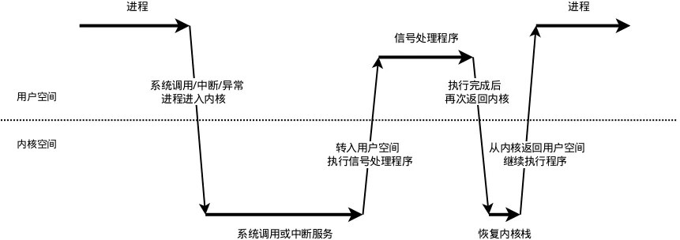
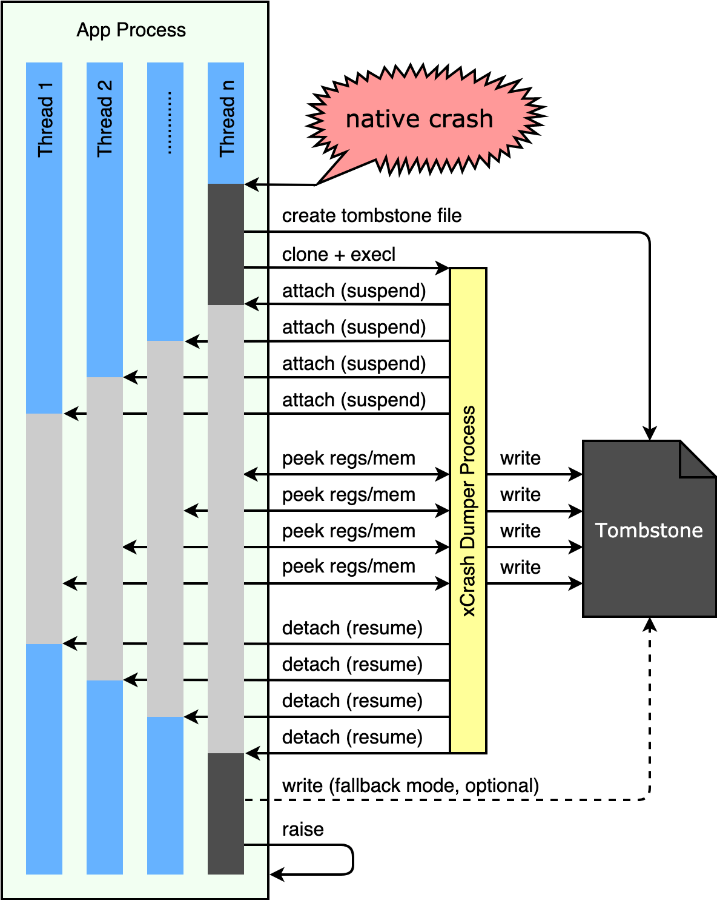
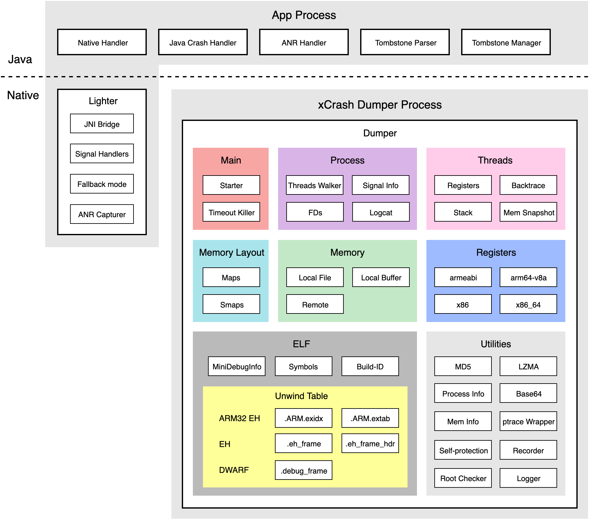

# 安卓 APP 崩溃捕获方案 xCrash

* Author: Kelun Cai (caikelun@gmail.com)
* Date: 2019-06-21
* Tags: Android, crash
* License: [Attribution 4.0 International (CC BY 4.0)](https://creativecommons.org/licenses/by/4.0/)

# 概述

[原文](https://mp.weixin.qq.com/s/bJKvrfO6B8NTGWySpeCYgA)

2019 年，爱奇艺在 GitHub 上开源了 xCrash。这是一个比较完整的安卓 APP 崩溃捕获 SDK，它能在 App 进程崩溃时，在你指定的目录中生成 tombstone 文件（格式与系统的 tombstone 文件类似）。它支持捕获 native 崩溃和 Java 崩溃；支持安卓 4.0 - 9.0；支持 armeabi，armeabi-v7a，arm64-v8a，x86 和 x86_64。

依托于爱奇艺安卓 APP 上亿的日活用户数据，xCrash 在兼容性、稳定性、功能完整性等方面不断地自我完善。目前 xCrash 已被应用于爱奇艺、爱奇艺极速版、爱奇艺动画屋、奇秀、爱奇艺 VR 影院、叭哒漫画等 20 余款爱奇艺的安卓 APP 中。

# 问题概述

在移动端 APP 的各种质量问题中，最严重的可能就是 APP 崩溃闪退了。

从安卓 APP 开发的角度，Java 崩溃捕获相对比较容易，JVM 给 Java 字节码提供了一个受控的运行环境，同时也提供了完善的 Java 崩溃捕获机制。Native 崩溃的捕获和处理相对比较困难，安卓系统的debuggerd 守护进程会为 native 崩溃自动生成详细的崩溃描述文件（tombstone）。

在开发调试阶段，可以通过系统提供的 bugreport 工具获取 tombstone 文件（或者将设备 root 后也可以拿到）。但是对于发布到线上的安卓 APP，如何获取 tombstone 文件，安卓操作系统本身并没有提供这样的功能。这个问题一直是安卓 native 崩溃分析和移动端 APM 系统的痛点之一。

# Native 崩溃介绍

## 信号

Native 崩溃发生在机器指令运行的层面。比如：APP 中的 so 库、系统的 so 库、JVM 本身等等。如果这部分程序做了 Linux kernel 认为不可接受的事情（比如：除数为零、让 CPU 执行它无法识别的指令等），kernel 就会向 APP 中对应的线程发送相应的信号（signal），这些信号的默认处理方式是杀死整个进程。用户态进程也可以发送 signal 终止其他进程或自身。这些致命的信号分为 2 类，主要有：

### kernel 发出的

* SIGFPE: 除数为零。
* SIGILL: 无法识别的 CPU 指令。
* SIGSYS: 无法识别的系统调用（system call）。
* SIGSEGV: 错误的虚拟内存地址访问。
* SIGBUS: 错误的物理设备地址访问。

### 用户态进程发出的

* SIGABRT: 调用 abort() / kill() / tkill() / tgkill() 自杀，或被其他进程通过 kill() / tkill() / tgkill() 他杀。

## 信号处理函数

Naive 崩溃捕获需要注册这些信号的处理函数（signal handler），然后在信号处理函数中收集数据。

因为信号是以“中断”的方式出现的，可能中断任何 CPU 指令序列的执行，所以在信号处理函数中，只能调用“异步信号安全（async-signal-safe）”的函数。例如malloc()、calloc()、free()、snprintf()、gettimeofday() 等等都是不能使用的，C++ STL / boost 也是不能使用的。

所以，在信号处理函数中我们只能不分配堆内存，需要使用堆内存只能在初始化时预分配。如果要使用不在异步信号安全白名单中的 libc / bionic 函数，只能直接调用 system call 或者自己实现。

## 进程崩溃前的极端情况

当崩溃捕获逻辑开始运行时，会面对很多糟糕的情况，比如：栈溢出、堆内存不可用、虚拟内存地址耗尽、FD 耗尽、Flash 空间耗尽等。有时，这些极端情况的出现，本身就是导致进程崩溃的间接原因。

### 栈溢出

我们需要预先用 sigaltstack() 为 signal handler 分配专门的栈内存空间，否则当遇到栈溢出时，signal handler 将无法正常运行。

### 虚拟内存地址耗尽

内存泄露很容易导致虚拟内存地址耗尽，特别是在 32 位环境中。这意味着在 signal handler 中也不能使用类似 mmap() 的调用。

### FD 耗尽

FD 泄露是常见的导致进程崩溃的间接原因。这意味着在 signal handler 中无法正常的使用依赖于 FD 的操作，比如无法 open() + read() 读取/proc 中的各种信息。为了不干扰 APP 的正常运行，我们仅仅预留了一个 FD，用于在崩溃时可靠的创建出“崩溃信息记录文件”。

### Flash 空间耗尽

在 16G / 32G 存储空间的安卓设备中，这种情况经常发生。这意味着 signal handler 无法把崩溃信息记录到本地文件中。我们只能尝试在初始化时预先创建一些“占坑”文件，然后一直循环使用这些“占坑”文件来记录崩溃信息。如果“占坑”文件也创建失败，我们需要把最重要的一些崩溃信息（比如 backtrace）保存在内存中，然后立刻回调和发送这些信息。

# xCrash 架构与实现

## 信号处理函数与子进程

在信号处理函数（signal handler）代码执行的开始阶段，我们只能“忍辱偷生”：

* 遵守它的各种限制。
* 不使用堆内存。
* 自己实现需要的调用的“异步信号安全版本”，比如：snprintf()、gettimeofday()。
* 必要时直接调用 system call。

但这并非长久之计，我们要尽快在信号处理函数中执行“逃逸”，即使用clone() + execl() 创建新的子进程，然后在子进程中继续收集崩溃信息。这样做的目的是：

* 避开 async-signal-safe 的限制。
* 避开虚拟内存地址耗尽的问题。
* 避开 FD 耗尽的问题。
* 使用 ptrace() suspend 崩溃进程中所有的线程。与 iOS 不同，Linux / Android 不支持 suspend 本进程内的线程。（如果不做 suspend，则其他未崩溃的线程还在继续执行，还在继续写 logcat，当我们收集 logcat 时，崩溃时间点附近的 logcat 可能早已被淹没。类似的，其他的业务 log buffers 也存在被淹没的问题。）
* 除了崩溃线程本身的 registers、backtrace 等，还能用 ptrace()收集到进程中其他所有线程的 registers、backtrace 等信息，这对于某些崩溃问题的分析是有意义的。
* 更安全的读取内存数据。（ptrace 读数据失败会返回错误码，但是在崩溃线程内直接读内存数据，如果内存地址非法，会导致段错误）

由此可以看出“逃逸”是必然的选择，整个过程如下图所示：

## 整体架构

xCrash 整体分为两部分：运行于崩溃的 APP 进程内的部分，和独立进程的部分（我们称为 dumper）。

### APP 进程内

这部分可以再分为 Java 和 native 两个部分。

#### Java 部分

* Java 崩溃捕获。直接使用 JVM 提供的机制来完成，最后生成兼容 tombstone 格式的 dump 文件。
* Native 崩溃捕获机制的注册器。通过 JNI 激活 native 层的对应机制。
* Tombstone 文件解析器。可以将 tombstone 文件解析成 json 格式。
* Tombstone 文件管理器。可以检索设备上已经生成的 tombstone 文件。

#### Native 部分

* JNI Bridge。负责与 Java 层的交互。（传参与回调）
* Signal handlers。负责信号捕获，以及启动独立进程 dumper。
* Fallback mode。负责当 dumper 捕获崩溃信息失败时，尝试在崩溃进行的 signal handler 中收集崩溃信息。

### Dumper 独立进程

这部分是纯 native 的实现：

* Process。负责崩溃进程中各个线程的控制（attach 和 detach），以及进程层面的信息收集，比如 FD 列表、logcat 等等。
* Threads。负责崩溃进程中的线程相关数据的收集，比如 registers、backtrace、stack 等等。
* Memory Layout。负责 maps 和 smaps 的解析。
* Memory。负责各种内存数据的读写。比如来自本地 buffer、来自mmap() 的 ELF 文件、或者通过 ptrace() 远程访问的崩溃进程的内存。
* Registers。负责各种处理机架构相关的数据处理。
* ELF。负责 ELF 信息的解析。需要解析各种 unwind table 和 symbols 信息，有时需要使用 LZMA 解压 .gnu_debugdata 中的 mini debug info 信息做进一步的处理。

## 获取 backtrace

获取 backtrace 是崩溃捕获中比较复杂和重要的部分，这也恰恰是安卓 native 开发中最混乱和不一致的地方之一。

### libc 对 backtrace 的支持

在 Linux 服务器环境中，当那些致命的 signal 发生时，系统可以为我们产生标准的 core dump 文件，之后我们可以用 gdb 调试和恢复崩溃现场，我们俗称“验尸”。

在 Linux 嵌入式环境中，由于 flash 空间有限，我们一般可以注册 signal handler，然后调用 libc 的 backtrace() 和backtrace_symbols_fd() 获取 backtrace。

（注意：不能使用backtrace_symbols()，它不是异步信号安全的）

### NDK 对 backtrace 的支持

NDK 中目前没有提供可靠的 unwind API。

安卓使用 bionic 替代了 libc，bionic 中没有 backtrace() 和backtrace_symbols_fd()。（它们不在 POSIX 标准中）

unwind.h 中的 _Unwind_Backtrace 系列函数对于高版本 Android 系统库几乎无效。（NDK 中的 unwind 实现，已经无法跟上 Android 系统快速的迭代优化）

### Google AOSP 的 backtrace 实现

各版本的 AOSP 都有系统自用的 backtrace 库，主要作用是配合系统 debuggerd 进程和调试器的工作。

* libcorkscrew：只用于 Android 4.1 - 4.4W。
* libunwind：只用于 Android 5.0 - 7.1.1。
* libunwindstack：只用于 Android 8.0 及以上版本。

如果 APP 直接使用这些库，会遇到以下的问题：

* 系统 debuggerd 是以 root 权限运行的，而我们的 APP 没有 root 权限，所以某些操作会受到限制。
* NDK 没有暴露这些系统库的对外调用接口。Android 7.0 以后 APP 无法直接 dlopen() 系统库，所以其中的 libunwind 和 libunwindstack 只能自己编译源码后放到 APP 中使用。
* 使用这些库的 local unwind 接口比较容易，但是使用 remote unwind 接口时适配比较复杂。（原因还是这些库是为了 debuggerd 和调试器设计的，不是为 APP 设计的）
* 高版本系统的 backtrace 库无法直接编译用于低版本的系统，libunwind 和 libunwindstack 中使用了大量低版本系统所没有的系统函数。所以作为 APP 只能分别编译这些系统 backtrace 库，然后在运行时根据系统 API level 动态判断需要使用哪个库。这显著的增加了 APP 包体积。

### xCrash 的 backtrace 实现

xCrash 参考了一部分 AOSP 和 BreakPad 的实现思路，在不需要 root 权限和兼容 Android 4.0 - 9.0 的前提下，自己实现了 unwind 逻辑。这样做的好处是 unwind 过程不再是一个黑盒，细节完全可控，遇到问题完全可调试。

Backtrace unwind 依赖于三部分数据：寄存器、栈内存、各 ELF 中的 unwind table。xCrash 目前能处理 Android 4.0 - 9.0 中可能出现的所有格式的 unwind table，它们来自于 ELF 中的以下 section：

* .ARM.exidx（只存在于 32 位 ARM 架构）
* .eh_frame 和 .eh_frame_hdr
* .debug_frame
* .gnu_debugdata（LZMA 压缩的 mini debug info，其中可能包含其他的 unwind table，比如：.debug_frame）

## xCrash 的其他功能

除了获取常见的设备信息、registers、backtrace、stack、memory near、maps、logcat 等基本信息，xCrash 还提供以下的功能：

### 完整的 FD 列表

让你知道崩溃时进程中的每一个 FD 具体都用在了哪里。

### 详细的内存使用统计

获取了操作系统全局的物理内存使用统计、崩溃进程的虚拟内存使用统计、崩溃进程的内存详细使用信息（类似 dumpsys meminfo）。让你对进程崩溃时的内存状态有全面的了解。

### 用正则白名单设置需要获取哪些线程的信息

APP 的线程数超过 100 个是很常见的，如果像系统 tombstone 那样总是获取全部线程的 registers、backtrace 等信息，在大多数情况下是没有必要的；这也容易导致 unwind 时间过长，崩溃捕获逻辑还没有走完，APP 就被系统强杀了。xCrash 让你能通过一组正则表达式白名单来设置需要获取哪些线程的信息。

### 零权限需求

xCrash 不需要 root 权限，也不需要任何的 APP 系统权限，这让使用 xCrash 的 APP 没有任何权限方面的负担。

### 监测设备是否已被 root

监测的过程是完全透明和无感知的。在后期分析数据时，如果发现某个崩溃只发生在已被 root 的设备上，就有理由怀疑是否是一些特别的原因造成的。

### 极高的崩溃信息捕获成功率

xCrash 通过 FD 预留；Flash “占坑”文件；写文件失败时通过预分配内存保存 backtrace 等重要信息做紧急回调、clone() + execl() 失败后进入 fallback 模式执行本地 unwind 等一系列保护措施，最大程度的保证了崩溃信息捕获的成功率。

### 扩展性支持

xCrash 支持崩溃后附加用户自定义信息。目前在爱奇艺 APP 中，已经通过 xCrash 的扩展能力，在崩溃时投递了大播放日志、弹幕日志、NLE视频编辑日志、APP Life Cycle Trace等信息。为排查特定业务的崩溃问题提供支持。

# xCrash 与 BreakPad 比较

BreakPad 是 Google 开发的跨平台崩溃捕获方案，目前主要用于 Chromium。安卓 APP 也可以使用 BreakPad 来捕获异常。

BreakPad 是一种“以后期调试为目的的崩溃捕获方案”，BreakPad 的崩溃捕获结果是一个二进制的 minidump 文件，需要后期拿到崩溃相关的所有 ELF 原始文件（包括系统动态库文件），然后开始进行类似 gdb 的调试过程，才能定位问题。

拿到每个崩溃机型上需要的系统库文件，这会是一个耗时的过程；再加上复杂的 APP 自身可能包含数十个 native 库，这些 native 库由不同的业务团队开发，并且在 APP 发版后还可能热更新。如果要把这整个过程自动化的完成，需要一个非常复杂的系统来支持。

在我们开发移动端 APM 系统和 xCrash SDK 的初期，曾经短暂的试用过 BreakPad，最后觉得这种方式对于我们来说后期的维护成本太高了，而收益看起来比较有限。

## BreakPad 的优势

对于特定的疑难问题，可以通过调试来获取到更多的寄存器和内存信息，也许有助于这些问题的解决。

## BreakPad 的弱点

* 后期的自动化处理比较复杂耗时，维护成本非常高。
* 后期处理时如果遇到对应系统库缺失、或者库版本错误的情况，就会无法拿到正确的 backtrace。这会影响到突发线上崩溃的报警，以及对突发崩溃的及时热修。
* BreakPad 自身的跨平台属性，以及较长的开发历史，导致了它的代码结构比较庞大而复杂，维护和二次开发的难度较大。

## 相对于 BreakPad，xCrash 的优势

* 完全在设备本地执行崩溃信息提取，生成系统标准的 tombstone 文本格式的 dump 信息。后期只要在服务端做简单的文本解析和聚合，就能快速发现线上的突发崩溃。
* tombstone 文本格式是安卓系统 debuggerd 的标准崩溃信息输出格式，无需再向开发人员解释该格式的具体含义。
* 专为安卓 APP 量身定制，接入使用的过程已经做到极简。

# xCrash 的未来计划

伴随着安卓本身以及移动端各项技术的快速发展，xCrash 未来还有很多事情可以做，例如：

* ANR 监控。
* 强化 fallback 模式。
* 减少 dump 过程中崩溃进程的卡顿。
* 崩溃次数和时间的本地记录和统计。
* 与 BreakPad 如何互补。

我们真诚的欢迎您和我们一起开发和维护 xCrash。

xCrash 在 GitHub 的项目地址：https://github.com/iqiyi/xCrash
